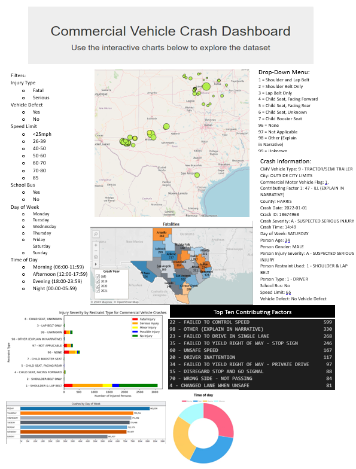
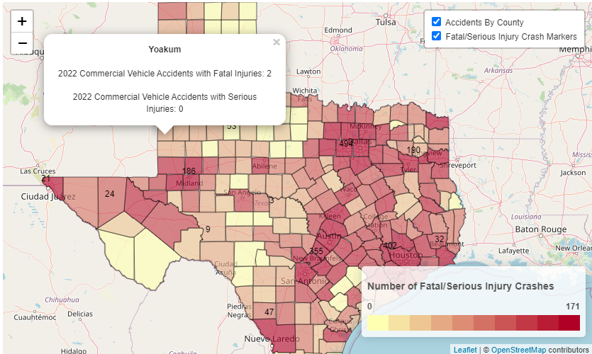
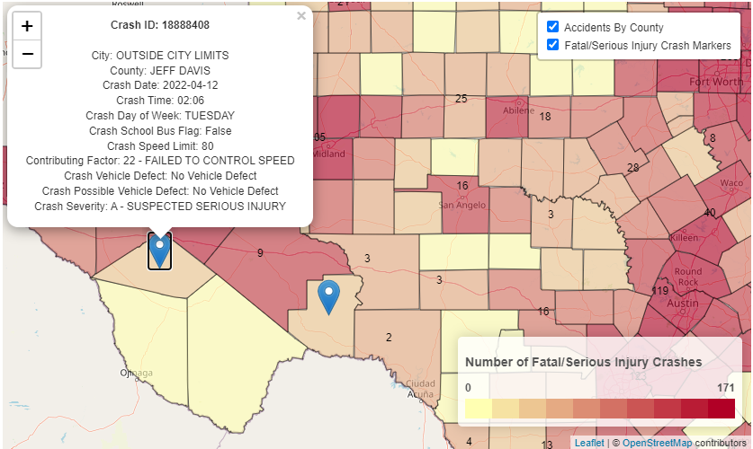

# CrashDash

Group members: Lisa Drain, Dhawn Alexander, Karen Fuentes, Kayla Bailey

Requirements:

* [ ] Your visualization must include:

* ~~Python Flask-powered API~~
* HTML/CSS JavaScript
* ~~and at least one database (SQLite)~~

* [X] Your project should fall into on of the following three tracks:

* A combination of web scraping and Leaflet or Plotly
* **A dashboard page with multiple charts that update from the same data**
* A server that performs multiple manipulations on data in a database prior to visualization ( **must be approved** )

* [X] Your project should include at least one JS library that we did not cover.

  * [Chart.js](https://www.chartjs.org/docs/latest/charts/doughnut.html)
* [X] Your project must be powered by a dataset with at least 100 records.( if using 2022 set)
* [ ] Your project must include some level of user-driven interaction (e.g., menus, dropdowns, textboxes).
* [ ] Your final visualization should ideally include at least three views.

  Table - Top 10 Contributing Factors
  Stacked Horizontal - Restraint type by Injury DHAWN
  [Doughnut](https://www.chartjs.org/docs/latest/charts/doughnut.html) - Time of Day (Chart.js) KAYLA
  Horizontal Bar Graph - Days of Week KAREN
  Map - choropleth, markers/bubble LISA

---

**Project Ideas Sketch**

---

### Tasks

* [X] ~~Load csv file and clean data together~~
* [X] ~~SQLite Database~~
* [X] ~~Demo Visualizations~~
* [X] ~~Create Python Flask-Powered API~~
* [ ] HTML/CSS JavaScript with Interactive Visualizations (4/17)
* [ ] Testing (4/17-4/19)
* [ ] Slide Deck, ReadMe Documentation, Practice (4/19)

---

**Focused Industry**: Insurance/Trucking

The aim of our project is to uncover patterns in commercial vehicle related accidents in Texas resulting in fatality or serious injury. We'll allow users to examine relationships between location, factors contributing to crashes, restraint types used, time of day, and day of the week.

## Data

[CRIS Query]([https://cris.dot.state.tx.us/public/Query/app/home](https://cris.dot.state.tx.us/public/Query/app/home)): 2022 Fatal & Serious Injury Crashes involving Commercial Vehicles in Texas

[Texas Counties Centroid Map](https://data.texas.gov/widgets/ups3-9e8m?mobile_redirect=true): Secondary dataset to fill in missing coordinates by county

CRIS Query Filters:

* Crash ID
* City
* Commercial Motor Vehicle Flag
* County
* Crash Date
* Crash Severity
* Crash Time
* Day of Week
* Latitude
* Longitude
* School Bus Flag
* Speed Limit
* CMV Vehicle Type
* Contributing Factor 1
* Possible Vehicle Defect 1
* Vehicle Defect 1
* Person Age
* Person Gender
* Person Injury Severity
* Person Restraint Used
* Person Type

## Requirements

* Pandas
* Numpy
* SQL Alchemy
* SQLite
* Matplotlib
* DateTime
* Flask
* pandas_geojson
* geopandas
* json

## Usage

Download repo .zip file. Open the backend folder, right click and then select Show More Options and then click Git Bash Here. Type in `<python app.py>` to run the Flask API. Navigate to your local host (in Git Bash you can copy the http:// that is shown after "Running on"). Once you verify that the routes are working there, open VS Code and right click on index.html (located in the frontend folder) and select Show in Browser. You should now be able to navigate the Crash Dash.

## Back End

#### Extraction

Our crash data set comes from using the Texas Department of Transportation [CRIS Query]([https://cris.dot.state.tx.us/public/Query/app/home](https://cris.dot.state.tx.us/public/Query/app/home)) where we were able to create a csv file for Fatal and Serious Injury crashes in Texas involving commercial vehicles in 2022, which we filtered further to include the following columns (Crash ID, City, Commercial Motor Vehicle Flag, County, Crash Date, Crash Severity, Crash Time, Day of Week, Latitude, Longitude, School Bus Flag, Speed Limit, CMV Vehicle Type, Contributing Factor 1, Possible Vehicle Defect 1, Vehicle Defect 1, Person Age, Person Gender, Person Injury Severity, Person Restraint Used, and Person Type). We also extracted the [Texas Counties Centroid Map](https://data.texas.gov/widgets/ups3-9e8m?mobile_redirect=true) csv file from data.texas.gov to get coordinates by county due to some missing values in the original dataset.

### Transformation

We merged the crash data and the county data together in order to fill in the missing coordinates where needed, and dropping the remaining county data. We filled in the missing values for the other columns and formatted the data types. We exported this file as `<cleaned_crash_data.csv>` and as `<cleaned_crash_data.geojson>`.

### Loading

We then loaded the transformed data (as well as the [Texas County Boundaries ](https://gis-txdot.opendata.arcgis.com/datasets/9b2eb7d232584572ad53bad41c76b04d_0/explore?location=30.911526%2C-100.049428%2C6.90)geojson file from Texas Department of Transportation) into a SQLite database `<crash_data>` using SQLAlchemy, storing the clean_crash_data in a table called `<crashes>`, the cleaned_crash_data.geojson in a table called `<geocrashes>`, and the Texas_County_Boundaries.geojson to a table called `<geoboundaries>`. We also completed some queries on the crashes table to explore the dataset and get an idea of possible visualizations.

### Flask API

A Python Flask API was developed to create a data source for the front-end visualizations.

## Front End

### JavaScript HTML/CSS

We created a JavaScript application utilizing Leaflet.js, D3.js, Plotly,js, Chart.js to create visualizations. 

We have a map of Texas with a choropleth layer to visualize Fatal/Serious Injury Crashes by county with a popup to display the number of Fatal and Serious Injury crashes by county. This map also has a marker layer to display each crash in the dataset with a popup providing additional details about the crash. The user is able to filter the map layers and zoom in and out.

