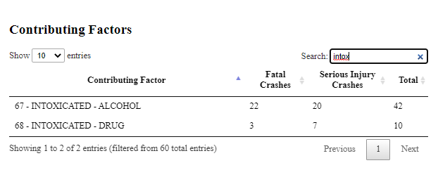

# CrashDash

Group members: Lisa Drain, Dhawn Alexander, Karen Fuentes, Kayla Bailey

---

**Focused Industry**: Insurance/Trucking

The aim of our project is to uncover patterns in commercial vehicle related accidents in Texas resulting in fatality or serious injury. We'll allow users to examine relationships between location, factors contributing to crashes, time of day, and day of the week.

---

## Data

[CRIS Query]([https://cris.dot.state.tx.us/public/Query/app/home](https://cris.dot.state.tx.us/public/Query/app/home))(.csv): 2022 Fatal & Serious Injury Crashes involving Commercial Vehicles in Texas

[Texas Counties Centroid Map](https://data.texas.gov/widgets/ups3-9e8m?mobile_redirect=true)(.csv): Secondary dataset to fill in missing coordinates by county

[Texas County Boundaries](https://gis-txdot.opendata.arcgis.com/datasets/9b2eb7d232584572ad53bad41c76b04d_0/explore?location=30.911526%2C-100.049428%2C6.90) (.geojson): Polygon layer of the 254 Texas counties.

# CRIS Query Filters:

|  Crash ID  |      City      |          Commercial Motor Vehicle Flag          |       Person Age       |
| :---------: | :------------: | :---------------------------------------------: | :--------------------: |
| Crash Date |     County     |                 School Bus Flag                 |     Person Gender     |
| Crash Time |    Latitude    |                CMV Vehicle Type                | Person Injury Severity |
| Day of Week |   Longitude   |              Contributing Factor 1              | Person Restraint Used |
| Speed Limit | Crash Severity | Vehicle Defect 1 Possible Vehicle Defect 1 |      Person Type      |

## Requirements

| Pandas | SQLAlchemy | Matplotlib | Flask | pandas_geojson |
| ------ | ---------- | ---------- | ----- | -------------- |
| Numpy  | SQLite     | DateTime   | json  | geopandas      |

## Usage

Download this repository .zip file. Open the backend folder, right click and then select Show More Options and then click Git Bash Here. Type in `'python app.py>'` to run the Flask API. Navigate to your local host (in Git Bash you can copy the http:// that is shown after "Running on"). Once you verify that the routes are working there, open VS Code and right click on index.html (located in the frontend folder) and select Show in Browser. You should now be able to navigate the CrashDash.

## Back End

#### Extraction

Our crash data set comes from using the Texas Department of Transportation [CRIS Query]([https://cris.dot.state.tx.us/public/Query/app/home](https://cris.dot.state.tx.us/public/Query/app/home)) where we were able to create a csv file for Fatal and Serious Injury crashes in Texas involving commercial vehicles in 2022, which we filtered further to include the following columns (Crash ID, City, Commercial Motor Vehicle Flag, County, Crash Date, Crash Severity, Crash Time, Day of Week, Latitude, Longitude, School Bus Flag, Speed Limit, CMV Vehicle Type, Contributing Factor 1, Possible Vehicle Defect 1, Vehicle Defect 1, Person Age, Person Gender, Person Injury Severity, Person Restraint Used, and Person Type). We also extracted the [Texas Counties Centroid Map](https://data.texas.gov/widgets/ups3-9e8m?mobile_redirect=true) csv file from data.texas.gov to get coordinates by county due to some missing values in the original dataset.

### Transformation

We merged the crash data and the county data together in order to fill in the missing coordinates where needed, and dropping the remaining county data. We filled in the missing values for the other columns and formatted the data types. We exported this file as `<cleaned_crash_data.csv>` and as `<cleaned_crash_data.geojson>`.

### Loading

We then loaded the transformed data (as well as the [Texas County Boundaries ](https://gis-txdot.opendata.arcgis.com/datasets/9b2eb7d232584572ad53bad41c76b04d_0/explore?location=30.911526%2C-100.049428%2C6.90)geojson file from Texas Department of Transportation) into a SQLite database `<crash_data>` using SQLAlchemy, storing the clean_crash_data in a table called `<crashes>`. We also completed some queries on the `<crashes>` table to explore the dataset and get an idea of possible visualizations. We also stored the cleaned_crash_data.geojson in a table called `<geocrashes>`, and the Texas_County_Boundaries.geojson to a table called `<geoboundaries>`.

### Flask API

A Python Flask API was developed to create a data source for the front-end visualizations.

Note: We were unable to successfully host the geoJson tables in the API, so these .geojson files are stored locally to create the Map. However, the other visualizations do utilize the API `<crashes>` table.

## Front End

### JavaScript HTML/CSS

We created a JavaScript application for user interactivity utilizing Leaflet.js, D3.js, DataTables, and Chart.js to create the visualizations. We also created an accompanying .html to define the dashboard and .css files to manipulate the appearance.

**Leaflet Map**: The map displayed has multiple layers for the user to navigate. `<Accidents by County>` displays a choropleth map indicatinig the number of fatal/serious injury crashes, additionally each county has a pop-up to display the number Fatal and Serious Injury crashes in that county. `<Fatal/Serious Injury Crash Markers>` allows the user to see grouped markers for crashes and individual markers can be selected to see additional crash information. `<Speed Limit: ranges>` allows user to visually see which counties had crashes where the speed limit fell within the specified range (limitation: upon selection, only one crash marker is displayed).

`<Accidents by County>`

`<Fatal/Serious Injury Crash Markers>`

`<Speed Limit: ranges>`

<a href="https://www.flaticon.com/free-icons/accident" title="accident icons">Accident icons created by M Karruly - Flaticon</a>

---

**Contributing Factors Table (DataTables)**:

Using DataTables, this presents the first Contributing Factor listed in each crash report, along with the number of times the factor was listed in fatal or serious injury crashes. Users can sort and search through the data.

---

**Time Doughnut (Chart.js)**:

This visualizes the number of crashes by time of day (Morning: 06:00-11:59, Afternoon: 12:00-17:59, Evening: 18:00-23:59, Night: 00:00-05:59).

---

Day of Week Horizontal Bar Graph (Plotly):

This visualizes the number of crashes by day of the week.

